# MarkdownLab

<div align="center">

<!-- Optional banner. Replace with your own image later. -->


[](https://nextjs.org/)
[](https://react.dev/)
[](https://www.typescriptlang.org/)
[](https://pages.github.com/)
[](https://www.markdownguide.org/)
[](https://mermaid.js.org/)

<br />

**MarkdownLab** is a fully client-side Markdown live preview studio for developers.  
Write Markdown, preview it live, render Mermaid diagrams, export to Word/PDF/HTML/Markdown, copy content in multiple formats, manage local documents, sync editor-preview scrolling, switch between dark/light modes, and share compressed encrypted documents through the URL — all without a backend.

<br />

[Live Demo](https://aaroophan.github.io/MarkdownLab) · [Report Bug](https://github.com/Aaroophan/MarkdownLab/issues) · [Request Feature](https://github.com/Aaroophan/MarkdownLab/issues)

</div>

---

## Table of Contents

- [1. What is MarkdownLab?](#1-what-is-markdownlab)
- [2. Project Philosophy](#2-project-philosophy)
- [3. Feature Overview](#3-feature-overview)
- [4. System Constraints](#4-system-constraints)
- [5. Architecture Overview](#5-architecture-overview)
- [6. Application Flow](#6-application-flow)
- [7. Core Modules](#7-core-modules)
- [8. Markdown Rendering Pipeline](#8-markdown-rendering-pipeline)
- [9. Mermaid Diagram Pipeline](#9-mermaid-diagram-pipeline)
- [10. Code Highlighting Pipeline](#10-code-highlighting-pipeline)
- [11. Document Storage Model](#11-document-storage-model)
- [12. LocalStorage Strategy](#12-localstorage-strategy)
- [13. Export System](#13-export-system)
- [14. Share Link System](#14-share-link-system)
- [15. Sync Scroll System](#15-sync-scroll-system)
- [16. Command Palette](#16-command-palette)
- [17. UI Layout](#17-ui-layout)
- [18. Keyboard Shortcuts](#18-keyboard-shortcuts)
- [19. Folder Structure](#19-folder-structure)
- [20. Recommended Packages](#20-recommended-packages)
- [21. Static Export Setup](#21-static-export-setup)
- [22. GitHub Pages Deployment](#22-github-pages-deployment)
- [23. Security Notes](#23-security-notes)
- [24. Known Limitations](#24-known-limitations)
- [25. Roadmap](#25-roadmap)
- [26. Development Setup](#26-development-setup)
- [27. Contribution Guide](#27-contribution-guide)
- [28. License](#28-license)

---

## 1. What is MarkdownLab?

MarkdownLab is a browser-based Markdown editor built as a **static Next.js application**.

It is designed for developers who want a clean, fast, local-first writing environment for:

- technical notes
- README files
- project reports
- developer documentation
- architecture diagrams
- Mermaid flowcharts
- Markdown tables
- code-heavy documents
- quick export-ready documents
- shareable Markdown previews

Unlike a backend-based document platform, MarkdownLab does not require accounts, databases, API routes, or server storage. It works fully inside the browser.

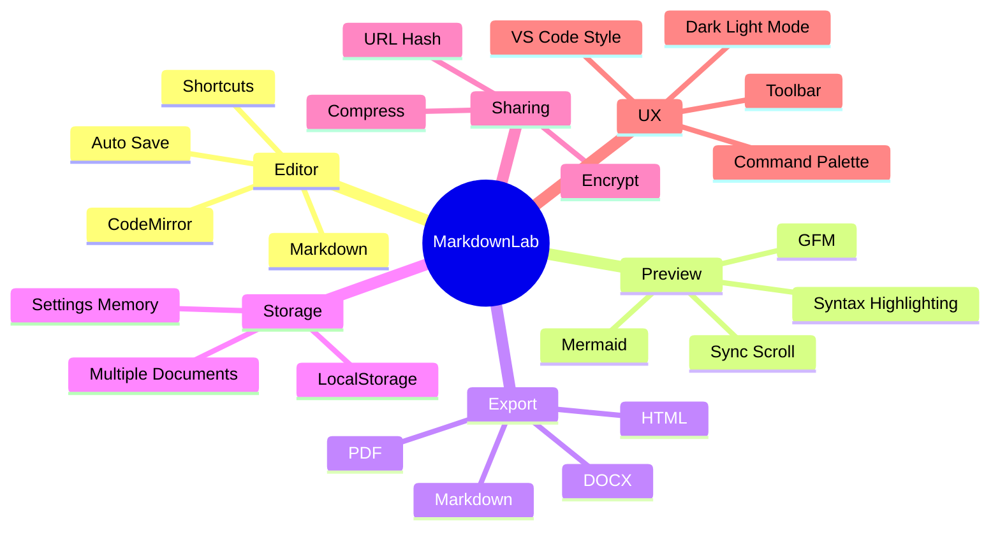

---

## 2. Project Philosophy

MarkdownLab is based on five design principles.

### 2.1 Local-first

The app should work without a backend. User documents are saved inside the browser using `localStorage`.

### 2.2 Developer-first

The interface should feel familiar to developers. The design direction is closer to **VS Code** than Notion.

### 2.3 Export-ready

The app should not only preview Markdown. It should help users produce real output formats:

- `.md`
- `.html`
- `.pdf`
- `.docx`

### 2.4 Diagram-friendly

Mermaid support is a core feature, not an afterthought. Diagrams should render inside preview and be included in export workflows where possible.

### 2.5 Static-hosting compatible

The app must work on:

```txt
https://aaroophan.github.io/MarkdownLab
```

That means it must not depend on server-only Next.js features.

---

## 3. Feature Overview

### 3.1 Editor Features

| Feature | Status | Description |
|---|---:|---|
| Markdown editor | Planned | Write Markdown using a developer-focused editor. |
| Live preview | Planned | Preview updates while typing. |
| Side-by-side layout | Planned | Editor and preview displayed together. |
| Resizable panels | Planned | Drag to resize editor and preview widths. |
| Preview-only mode | Planned | Hide full editor UI and show clean preview. |
| Dark/light mode | Planned | UI supports both dark and light themes. |
| Auto save | Planned | Save active document automatically. |
| Manual save | Planned | Explicit save action available. |
| Multiple documents | Planned | Manage more than one local document. |
| Open `.md` file | Planned | Import local Markdown files. |
| Local memory | Planned | Remember documents, theme, layout, scroll, and settings. |
| Clear local data | Planned | Reset stored browser data. |

### 3.2 Markdown Features

| Feature | Status | Description |
|---|---:|---|
| GitHub-Flavored Markdown | Planned | Tables, task lists, strikethrough, autolinks. |
| Headings | Planned | `#`, `##`, `###`, etc. |
| Tables | Planned | Markdown tables with preview rendering. |
| Task lists | Planned | `- [ ]` and `- [x]` checkboxes. |
| Blockquotes | Planned | Quoted text blocks. |
| Links | Planned | Markdown links and auto-linked URLs. |
| Images by URL | Planned | Image rendering from remote/local path URLs. |
| Footnotes | Planned | Footnote syntax support. |
| Emoji | Planned | Emoji rendering where supported. |
| Math equations | Planned | Inline and block math support. |
| Table of contents / outline | Planned | Generated from headings. |

### 3.3 Developer Features

| Feature | Status | Description |
|---|---:|---|
| Code syntax highlighting | Planned | Highlight code blocks by language. |
| GitHub Dark code theme | Planned | Code blocks styled with GitHub Dark feel. |
| Unsupported language fallback | Planned | Unknown language renders as plain text. |
| Copy code block | Planned | Every code block gets a copy button. |
| Code block filename/title | Planned | Optional title metadata for code blocks. |
| Line numbers | Planned | Code blocks can show line numbers. |
| Highlighted lines | Planned | Support syntax for selected highlighted lines. |

### 3.4 Mermaid Features

| Feature | Status | Description |
|---|---:|---|
| Mermaid block detection | Planned | Detect code blocks with `mermaid` language. |
| Live Mermaid rendering | Planned | Render diagrams in preview. |
| Mermaid error handling | Planned | Show readable error box if diagram fails. |
| Mermaid in HTML export | Planned | Export with embedded Mermaid script. |
| Mermaid in PDF export | Planned | Render diagram before PDF capture. |
| Mermaid in DOCX export | Planned | Convert rendered diagram to image where possible. |

### 3.5 Export Features

| Export | Status | Description |
|---|---:|---|
| Markdown export | Planned | Download active document as `.md`. |
| HTML export | Planned | Export full standalone HTML with styles and Mermaid support. |
| PDF export | Planned | Export preview as document-style PDF. |
| DOCX export | Planned | Generate real Word `.docx` file. |
| Copy Markdown | Planned | Copy raw Markdown. |
| Copy HTML | Planned | Copy rendered HTML. |
| Copy plain text | Planned | Copy preview text without Markdown syntax. |
| Copy share link | Planned | Copy compressed encrypted URL. |

### 3.6 Share Features

| Feature | Status | Description |
|---|---:|---|
| URL-only sharing | Planned | Store document payload in URL hash. |
| Compression | Planned | Compress document before URL encoding. |
| Encryption | Planned | Encrypt payload before putting into URL. |
| No password | Planned | Anyone with link can open the document. |
| Large document fallback | Planned | Offer file download if URL becomes too large. |

---

## 4. System Constraints

MarkdownLab intentionally follows strict constraints.

| Constraint | Decision |
|---|---|
| Hosting | GitHub Pages |
| Build type | Next.js static export |
| Backend | None |
| Database | None |
| Authentication | None |
| Server actions | Not allowed |
| API routes | Not allowed |
| File storage | Browser-only |
| Sharing | URL hash payload |
| Export processing | Browser-only |
| Mermaid rendering | Browser-only |
| PDF generation | Browser-only |
| DOCX generation | Browser-only |

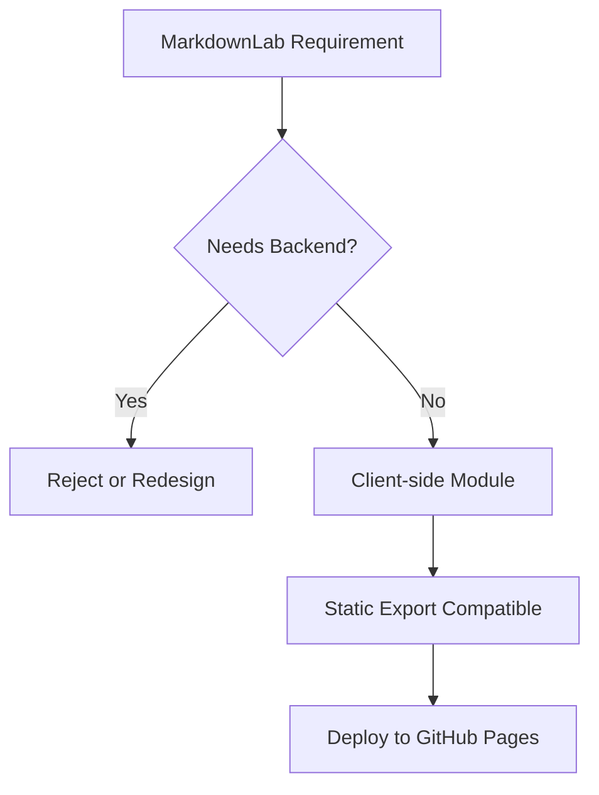

---

## 5. Architecture Overview

MarkdownLab is organized around independent client-side engines.

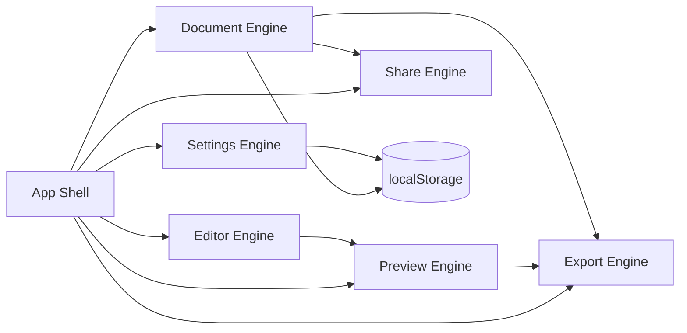

### Main architecture layers

| Layer | Responsibility |
|---|---|
| App Shell | Overall layout, sidebar, panels, toolbar, status bar. |
| Document Engine | Create, rename, delete, import, save, and switch documents. |
| Editor Engine | CodeMirror editor, keyboard shortcuts, toolbar insertions. |
| Preview Engine | Markdown parsing, HTML preview, Mermaid rendering, code highlighting. |
| Export Engine | `.md`, `.html`, `.pdf`, `.docx`, copy flows. |
| Share Engine | Compress, encrypt, encode, decode, import shared documents. |
| Settings Engine | Theme, layout, panel ratio, sync scroll, export preferences. |

---

## 6. Application Flow

### 6.1 Normal editing flow

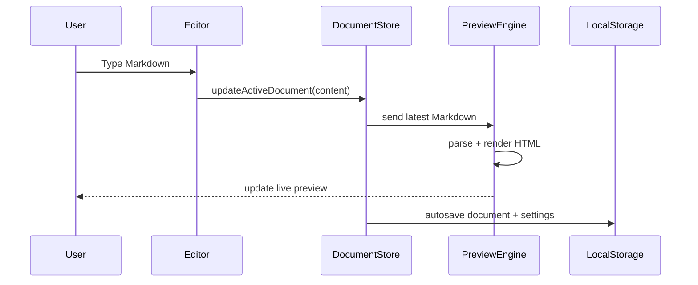

### 6.2 File import flow

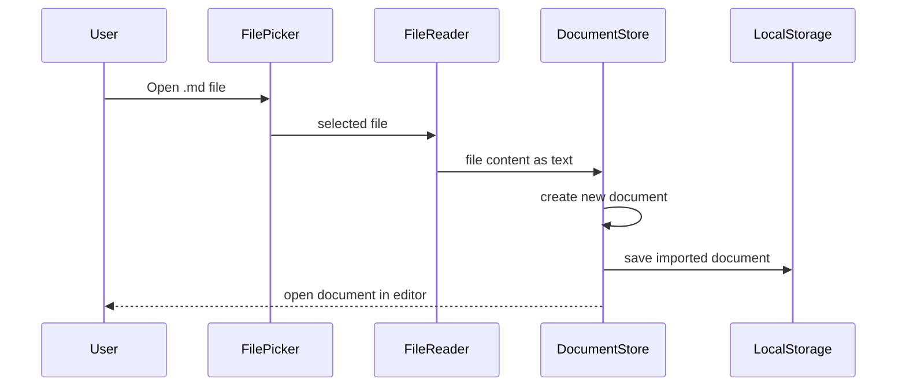

### 6.3 Export flow

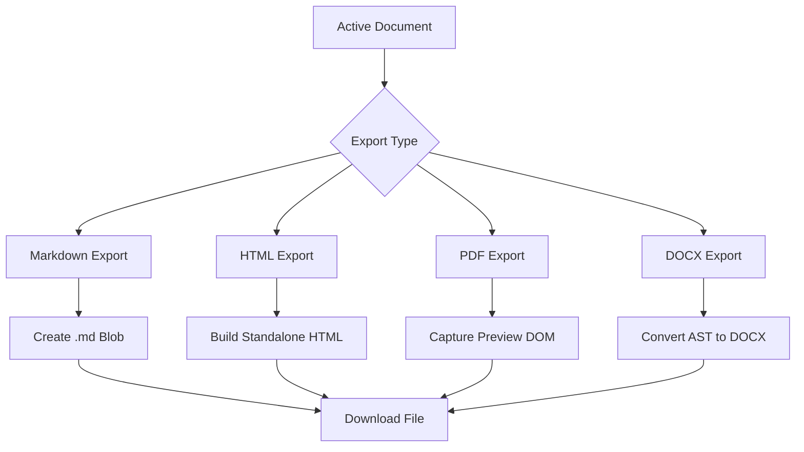

### 6.4 Share flow

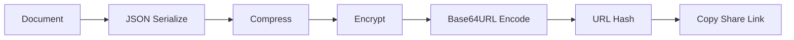

### 6.5 Open shared link flow

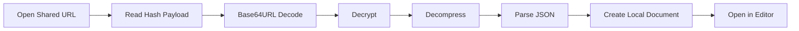

---

## 7. Core Modules

## 7.1 App Shell

The App Shell controls the overall interface.

### Responsibilities

- render top toolbar
- render document sidebar
- render editor panel
- render preview panel
- render status bar
- render modals
- connect stores together
- handle responsive layout

### Suggested file

```txt
src/components/layout/AppShell.tsx
```

### App shell structure

```tsx
<AppShell>
  <TopToolbar />
  <MainWorkspace>
    <DocumentSidebar />
    <ResizableSplitPane>
      <EditorPanel />
      <PreviewPanel />
    </ResizableSplitPane>
  </MainWorkspace>
  <StatusBar />
  <CommandPalette />
</AppShell>
```

---

## 7.2 Document Engine

The Document Engine manages local Markdown documents.

### Responsibilities

- create document
- duplicate document
- rename document
- delete document
- import `.md` file
- export `.md` file
- set active document
- autosave active document
- manual save active document
- track dirty state

### Suggested files

```txt
src/features/documents/documentTypes.ts
src/features/documents/documentStore.ts
src/features/documents/documentStorage.ts
src/features/documents/documentActions.ts
```

### Document type

```ts
export type MarkdownDocument = {
  id: string
  title: string
  content: string
  createdAt: string
  updatedAt: string
  lastOpenedAt: string
  source?: "manual" | "import" | "share"
}
```

### Document state

```ts
export type DocumentState = {
  documents: MarkdownDocument[]
  activeDocumentId: string | null
  dirtyDocumentIds: string[]
}
```

### Document actions

```ts
export type DocumentActions = {
  createDocument: () => void
  importDocument: (file: File) => Promise<void>
  renameDocument: (id: string, title: string) => void
  deleteDocument: (id: string) => void
  duplicateDocument: (id: string) => void
  setActiveDocument: (id: string) => void
  updateActiveContent: (content: string) => void
  saveActiveDocument: () => void
  clearAllDocuments: () => void
}
```

---

## 7.3 Editor Engine

The Editor Engine is responsible for the actual Markdown editing experience.

### Responsibilities

- render CodeMirror editor
- apply GitHub Dark editor theme
- support Markdown syntax highlighting
- handle shortcuts
- insert Markdown snippets
- track cursor position
- track visible line
- support sync scroll
- support local file import

### Suggested files

```txt
src/features/editor/MarkdownEditor.tsx
src/features/editor/editorExtensions.ts
src/features/editor/editorShortcuts.ts
src/features/editor/insertMarkdown.ts
src/features/editor/scrollSync.ts
```

### Editor commands

| Command | Markdown inserted |
|---|---|
| Bold | `**text**` |
| Italic | `_text_` |
| Link | `[label](https://example.com)` |
| Image | `` |
| Code block | triple backtick block |
| Mermaid | triple backtick `mermaid` block |
| Table | Markdown table |
| Quote | `> quote` |
| Task item | `- [ ] task` |

---

## 7.4 Preview Engine

The Preview Engine converts Markdown into safe rendered HTML.

### Responsibilities

- parse Markdown
- apply GFM support
- apply math support
- sanitize HTML
- detect Mermaid blocks
- render code blocks
- build outline from headings
- generate plain text for copy
- expose preview DOM for export

### Suggested files

```txt
src/features/preview/MarkdownPreview.tsx
src/features/preview/markdownPipeline.ts
src/features/preview/mermaidRenderer.ts
src/features/preview/codeBlockRenderer.ts
src/features/preview/outlineBuilder.ts
src/features/preview/plainTextExtractor.ts
```

---

## 7.5 Export Engine

The Export Engine converts the active document into downloadable or copyable output.

### Responsibilities

- export Markdown
- export standalone HTML
- export PDF
- export DOCX
- copy Markdown
- copy HTML
- copy plain text
- copy selected code block
- copy share link

### Suggested files

```txt
src/features/export/exportMarkdown.ts
src/features/export/exportHtml.ts
src/features/export/exportPdf.ts
src/features/export/exportDocx.ts
src/features/export/copyService.ts
src/features/export/downloadFile.ts
src/features/export/exportTheme.css
```

---

## 7.6 Share Engine

The Share Engine converts a document into a compressed encrypted URL payload.

### Responsibilities

- serialize document
- compress payload
- encrypt payload
- encode payload
- build URL hash
- decode shared URL
- import shared document
- detect too-large share payload
- fallback to file download

### Suggested files

```txt
src/features/share/shareTypes.ts
src/features/share/compress.ts
src/features/share/encrypt.ts
src/features/share/base64url.ts
src/features/share/urlShare.ts
src/features/share/shareLimits.ts
```

---

## 7.7 Settings Engine

The Settings Engine stores UI preferences.

### Responsibilities

- dark/light mode
- panel ratio
- preview-only mode
- sync scroll toggle
- scroll position memory
- export theme
- command palette state
- recently opened documents

### Suggested files

```txt
src/features/settings/settingsTypes.ts
src/features/settings/settingsStore.ts
src/features/settings/settingsStorage.ts
```

---

## 8. Markdown Rendering Pipeline

MarkdownLab should not render Markdown directly with unsafe string replacement. It should use a structured Markdown pipeline.

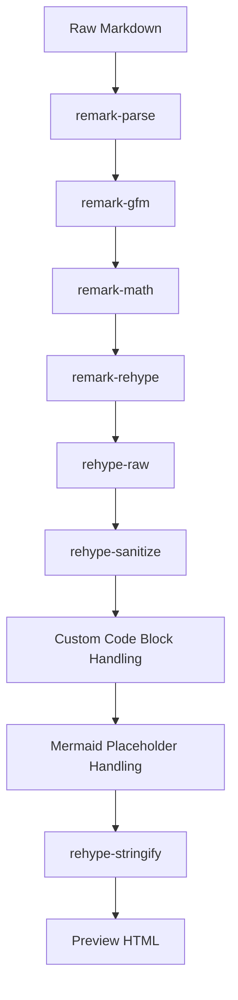

### Why use AST-based processing?

MarkdownLab needs advanced behavior:

- detect headings for outline
- detect Mermaid code blocks
- detect source lines for sync scroll
- detect code block language
- sanitize unsafe HTML
- export to other formats later

An AST pipeline gives more control than simple Markdown-to-HTML conversion.

### Example processing output

Input:

````md
# Architecture


```ts
const app = "MarkdownLab"
```
````

Output concept:

```html
<h1 data-source-line="1" id="architecture">Architecture</h1>
<div class="mermaid" data-source-line="3">flowchart TD...</div>
<pre data-source-line="8"><code class="language-ts">...</code></pre>
```

---

## 9. Mermaid Diagram Pipeline

Mermaid diagrams are written inside Markdown code blocks.

### Markdown syntax

````md
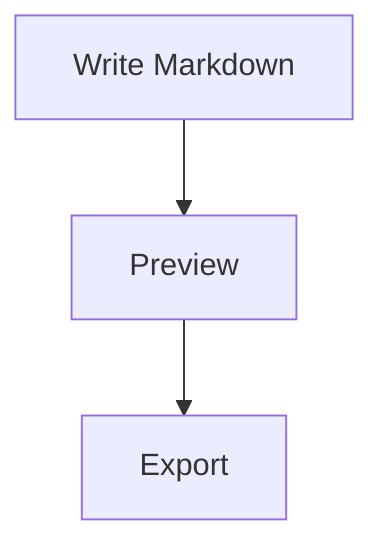
````

### Rendering flow

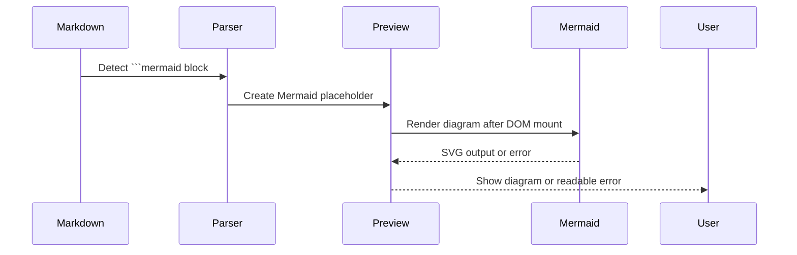

### Error handling

If the Mermaid syntax is wrong, the preview must not crash.

Instead, show:

```txt
Mermaid diagram error
Line 2: Unexpected token
```

### Mermaid preview component behavior

```tsx
<MermaidBlock code={diagramSource} sourceLine={lineNumber} />
```

Expected responsibilities:

- receive Mermaid source
- call Mermaid render API
- catch render errors
- display SVG if valid
- display error box if invalid
- expose rendered SVG for export

---

## 10. Code Highlighting Pipeline

MarkdownLab should support GitHub Dark style code blocks.

### Required behavior

- language-specific syntax highlighting
- copy button per code block
- optional filename/title
- line numbers
- highlighted lines
- fallback for unknown languages

### Code block examples

````md
```ts title="main.ts" {2,4-5}
const name = "MarkdownLab"
console.log(name)
```
````

````md
```unknownlang
some unknown language syntax
```
````

### Pipeline

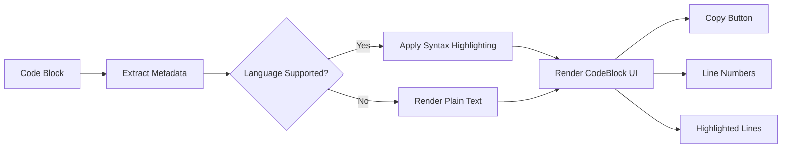

### Code block metadata model

```ts
export type CodeBlockMeta = {
  language: string | null
  title?: string
  highlightedLines: number[]
  rawCode: string
}
```

---

## 11. Document Storage Model

MarkdownLab stores documents locally in the browser.

### Single document structure

```ts
export type MarkdownDocument = {
  id: string
  title: string
  content: string
  createdAt: string
  updatedAt: string
  lastOpenedAt: string
  source?: "manual" | "import" | "share"
}
```

### Full storage structure

```ts
export type MarkdownLabStorage = {
  version: number
  activeDocumentId: string | null
  documents: MarkdownDocument[]
  settings: MarkdownLabSettings
}
```

### Settings structure

```ts
export type MarkdownLabSettings = {
  theme: "dark" | "light"
  layoutMode: "split" | "editor" | "preview"
  splitDirection: "horizontal"
  panelRatio: number
  syncScroll: boolean
  previewOnly: boolean
  codeTheme: "github-dark"
  exportTheme: "light"
  rememberScroll: boolean
  scrollPositions: Record<string, number>
}
```

---

## 12. LocalStorage Strategy

### Storage key

```ts
const STORAGE_KEY = "markdownlab:storage:v1"
```

### Save behavior

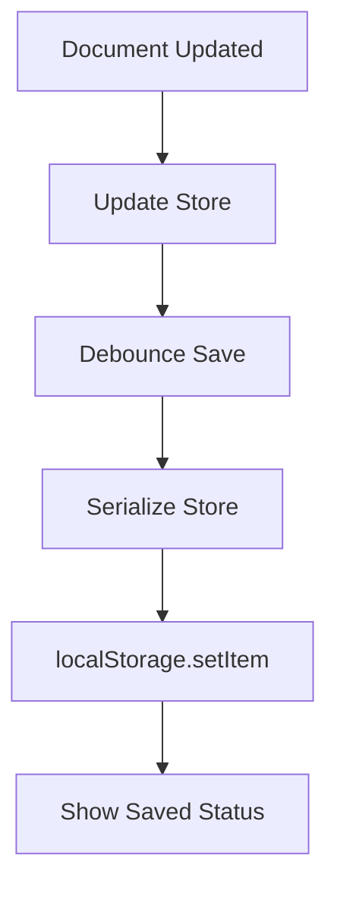

### Load behavior

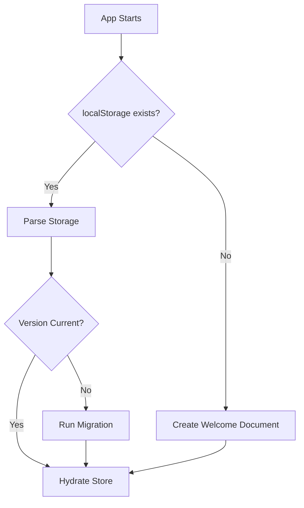

### Migration strategy

```ts
export function migrateStorage(storage: unknown): MarkdownLabStorage {
  // validate old shape
  // upgrade if needed
  // return safe current version
}
```

---

## 13. Export System

MarkdownLab supports four export formats.

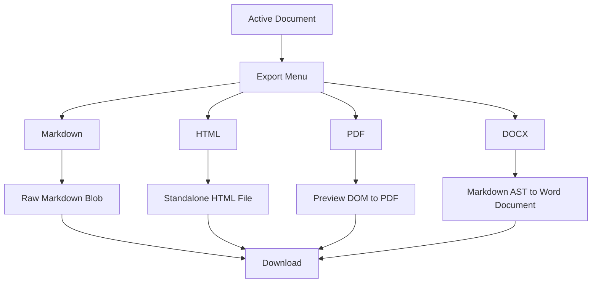

### 13.1 Markdown export

Markdown export is the simplest export.

Input:

```txt
activeDocument.content
```

Output:

```txt
document-title.md
```

Implementation concept:

```ts
export function exportMarkdown(document: MarkdownDocument) {
  downloadTextFile(`${document.title}.md`, document.content, "text/markdown")
}
```

---

### 13.2 HTML export

HTML export should be standalone.

It should include:

- rendered HTML body
- embedded CSS
- light export theme
- Mermaid support script
- code block styles

Example output structure:

```html
<!doctype html>
<html lang="en">
<head>
  <meta charset="UTF-8" />
  <meta name="viewport" content="width=device-width, initial-scale=1.0" />
  <title>Document Title</title>
  <style>
    /* embedded export styles */
  </style>
</head>
<body>
  <main class="markdownlab-export">
    <!-- rendered markdown -->
  </main>

  <script src="https://cdn.jsdelivr.net/npm/mermaid/dist/mermaid.min.js"></script>
  <script>
    mermaid.initialize({ startOnLoad: true, theme: "default" })
  </script>
</body>
</html>
```

---

### 13.3 PDF export

PDF export should use a document style, not a dark editor style.

Requirements:

- light theme export
- no page numbers
- no custom title/date
- no table of contents
- Mermaid diagrams included
- code blocks included
- preview visual layout preserved where possible

Conceptual flow:

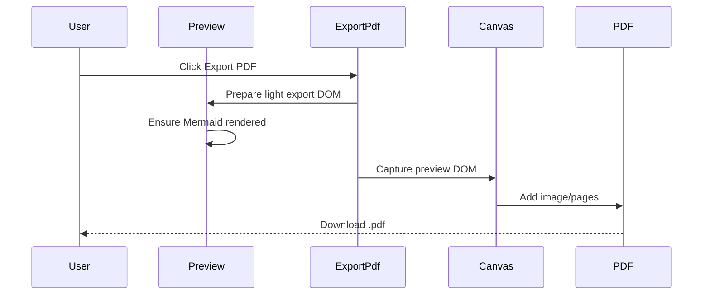

---

### 13.4 DOCX export

DOCX export should generate a real `.docx` file.

DOCX support target:

| Markdown element | DOCX output |
|---|---|
| Heading | Word heading |
| Paragraph | Word paragraph |
| Bold | Bold run |
| Italic | Italic run |
| List | Word list |
| Table | Word table |
| Code block | Monospace block |
| Link | Hyperlink |
| Mermaid | Image if rendered successfully |

Conceptual flow:

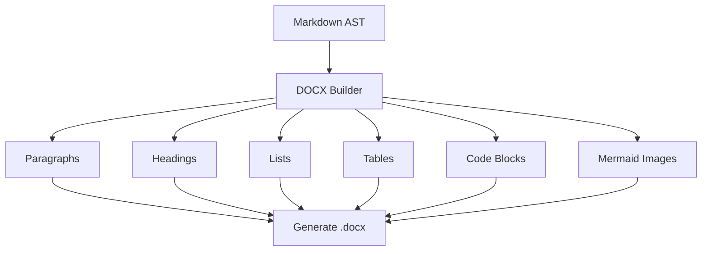

---

## 14. Share Link System

MarkdownLab supports backend-free sharing.

### Requirement

User writes Markdown and clicks share.

The app should:

1. serialize the document
2. compress the content
3. encrypt/encode the payload
4. place it in the URL hash
5. copy the generated URL

### URL format

```txt
https://aaroophan.github.io/MarkdownLab/#mdlab=<payload>
```

### Share payload

```ts
export type SharePayload = {
  version: 1
  title: string
  content: string
  createdAt: string
}
```

### Share pipeline

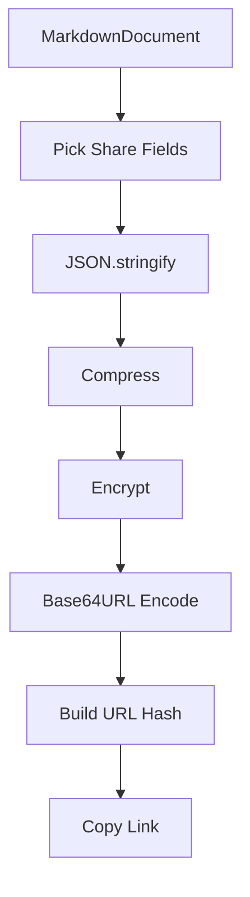

### Import shared link pipeline

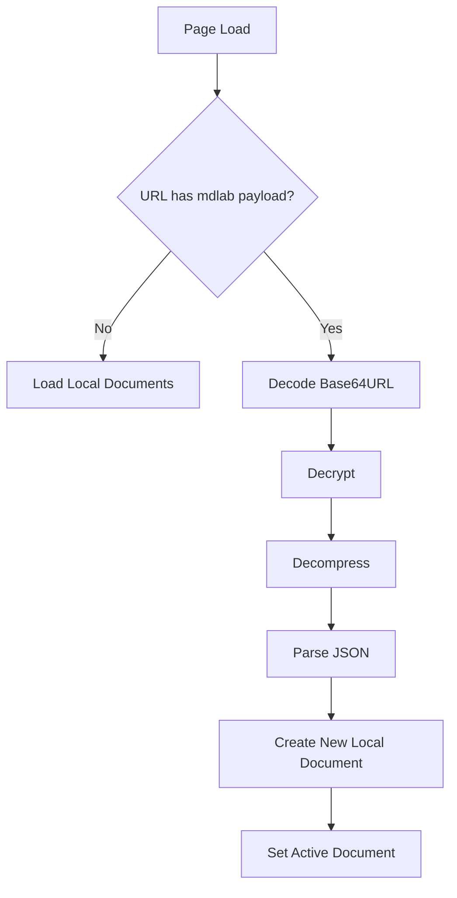

### Important security note

Because MarkdownLab does not use a password for share links, anyone with the link can open the shared document.

This is useful for hiding raw text from casual viewing, but it should not be described as secure private storage.

### Large URL behavior

If the generated URL is too large:

```mermaid
flowchart TD
    A[Generate Share URL] --> B{URL length safe?}
    B -->|Yes| C[Copy Link]
    B -->|No| D[Show Warning]
    D --> E[Offer .md Download Instead]
```

---

## 15. Sync Scroll System

MarkdownLab supports accurate two-way scroll sync.

### Required behavior

| Direction | Required |
|---|---:|
| Editor to preview | Yes |
| Preview to editor | Yes |
| Toggle off | Yes |
| Accurate mapping | Yes |

### Problem

Editor content is plain text lines. Preview content is rendered HTML blocks.

To sync accurately, MarkdownLab needs a mapping between source lines and preview elements.

### Mapping strategy

During Markdown processing, preview elements should receive source metadata.

Example:

```html
<h2 data-source-line="12" id="export-system">Export System</h2>
<p data-source-line="14">PDF export should...</p>
<pre data-source-line="20">...</pre>
```

### Editor-to-preview flow

```mermaid
sequenceDiagram
    participant Editor
    participant ScrollSync
    participant Preview

    Editor->>ScrollSync: visible line changed
    ScrollSync->>ScrollSync: find closest preview block
    ScrollSync->>Preview: scroll block into matching position
```

### Preview-to-editor flow

```mermaid
sequenceDiagram
    participant Preview
    participant ScrollSync
    participant Editor

    Preview->>ScrollSync: visible preview block changed
    ScrollSync->>ScrollSync: read data-source-line
    ScrollSync->>Editor: scroll to matching editor line
```

### Infinite loop protection

```ts
let activeScrollSource: "editor" | "preview" | null = null
```

When editor scroll triggers preview scroll, preview scroll events should be ignored briefly.

---

## 16. Command Palette

MarkdownLab should include a command palette because the app is developer-focused.

### Shortcut

```txt
Ctrl + K
```

### Command categories

```mermaid
mindmap
  root((Command Palette))
    Documents
      New Document
      Import Markdown
      Rename Document
      Delete Document
    Export
      Export Markdown
      Export HTML
      Export PDF
      Export DOCX
    Copy
      Copy Markdown
      Copy HTML
      Copy Plain Text
      Copy Share Link
    View
      Toggle Theme
      Toggle Preview Only
      Toggle Sync Scroll
      Toggle Sidebar
    Insert
      Table
      Mermaid Diagram
      Code Block
      Link
      Task List
```

### Command model

```ts
export type Command = {
  id: string
  label: string
  description?: string
  category: "document" | "export" | "copy" | "view" | "insert"
  shortcut?: string
  run: () => void | Promise<void>
}
```

---

## 17. UI Layout

MarkdownLab uses a VS Code-inspired layout.

```txt
┌──────────────────────────────────────────────────────────────┐
│ Top Toolbar                                                   │
├───────────────┬───────────────────────┬──────────────────────┤
│ Document List │ Markdown Editor        │ Live Preview          │
│               │                       │                      │
│               │                       │                      │
├───────────────┴───────────────────────┴──────────────────────┤
│ Status Bar: saved • words • chars • reading time • sync state │
└──────────────────────────────────────────────────────────────┘
```

### Main UI components

| Component | Purpose |
|---|---|
| `AppShell` | Overall app layout. |
| `TopToolbar` | Main actions. |
| `DocumentSidebar` | Local documents list. |
| `EditorPanel` | CodeMirror editor wrapper. |
| `PreviewPanel` | Markdown preview wrapper. |
| `ResizableSplitPane` | Drag-resizable editor/preview split. |
| `StatusBar` | Word count, saved status, active mode. |
| `CommandPalette` | Keyboard-driven actions. |
| `ExportMenu` | Export format selector. |
| `ShareDialog` | Share URL generation and copy. |
| `TableGeneratorDialog` | Insert Markdown tables. |

### Preview-only mode

Preview-only mode hides:

- editor panel
- document sidebar
- editing toolbar controls

It keeps:

- preview content
- minimal top action bar
- theme toggle
- exit preview-only button

---

## 18. Keyboard Shortcuts

| Shortcut | Action |
|---|---|
| `Ctrl + K` | Open command palette |
| `Ctrl + S` | Manual save |
| `Ctrl + B` | Bold selected text |
| `Ctrl + I` | Italic selected text |
| `Ctrl + Shift + P` | Toggle preview-only mode |
| `Ctrl + Alt + E` | Open export menu |
| `Ctrl + Alt + S` | Toggle sync scroll |
| `Ctrl + Alt + T` | Toggle theme |
| `Ctrl + Alt + N` | New document |
| `Ctrl + Alt + O` | Open/import Markdown file |

---

## 19. Folder Structure

Recommended folder structure:

```txt
MarkdownLab/
├── public/
│   ├── favicon.ico
│   └── screenshots/
│
├── src/
│   ├── app/
│   │   ├── globals.css
│   │   ├── layout.tsx
│   │   └── page.tsx
│   │
│   ├── components/
│   │   ├── common/
│   │   │   ├── IconButton.tsx
│   │   │   ├── Modal.tsx
│   │   │   └── ToastProvider.tsx
│   │   │
│   │   ├── layout/
│   │   │   ├── AppShell.tsx
│   │   │   ├── TopToolbar.tsx
│   │   │   ├── StatusBar.tsx
│   │   │   └── ResizableSplitPane.tsx
│   │   │
│   │   └── dialogs/
│   │       ├── ExportDialog.tsx
│   │       ├── ShareDialog.tsx
│   │       ├── ClearStorageDialog.tsx
│   │       └── TableGeneratorDialog.tsx
│   │
│   ├── features/
│   │   ├── documents/
│   │   │   ├── DocumentSidebar.tsx
│   │   │   ├── documentTypes.ts
│   │   │   ├── documentStore.ts
│   │   │   ├── documentStorage.ts
│   │   │   └── documentActions.ts
│   │   │
│   │   ├── editor/
│   │   │   ├── MarkdownEditor.tsx
│   │   │   ├── editorExtensions.ts
│   │   │   ├── editorShortcuts.ts
│   │   │   ├── insertMarkdown.ts
│   │   │   └── scrollSync.ts
│   │   │
│   │   ├── preview/
│   │   │   ├── MarkdownPreview.tsx
│   │   │   ├── markdownPipeline.ts
│   │   │   ├── mermaidRenderer.ts
│   │   │   ├── CodeBlock.tsx
│   │   │   ├── outlineBuilder.ts
│   │   │   └── plainTextExtractor.ts
│   │   │
│   │   ├── export/
│   │   │   ├── exportMarkdown.ts
│   │   │   ├── exportHtml.ts
│   │   │   ├── exportPdf.ts
│   │   │   ├── exportDocx.ts
│   │   │   ├── copyService.ts
│   │   │   ├── downloadFile.ts
│   │   │   └── exportStyles.ts
│   │   │
│   │   ├── share/
│   │   │   ├── shareTypes.ts
│   │   │   ├── compress.ts
│   │   │   ├── encrypt.ts
│   │   │   ├── base64url.ts
│   │   │   ├── urlShare.ts
│   │   │   └── shareLimits.ts
│   │   │
│   │   ├── settings/
│   │   │   ├── settingsTypes.ts
│   │   │   ├── settingsStore.ts
│   │   │   └── settingsStorage.ts
│   │   │
│   │   └── command-palette/
│   │       ├── CommandPalette.tsx
│   │       ├── commandTypes.ts
│   │       └── commandRegistry.ts
│   │
│   ├── lib/
│   │   ├── constants.ts
│   │   ├── createId.ts
│   │   ├── safeJson.ts
│   │   ├── formatDate.ts
│   │   └── browser.ts
│   │
│   └── styles/
│       ├── markdown.css
│       ├── code.css
│       └── export.css
│
├── .github/
│   └── workflows/
│       └── deploy.yml
│
├── next.config.ts
├── package.json
├── tsconfig.json
└── README.md
```

---

## 20. Recommended Packages

### Core UI and state

```bash
npm install zustand lucide-react framer-motion sonner
```

### Editor

```bash
npm install @uiw/react-codemirror @codemirror/lang-markdown @uiw/codemirror-theme-github
```

### Markdown processing

```bash
npm install unified remark-parse remark-gfm remark-math remark-rehype rehype-raw rehype-sanitize rehype-stringify
```

### Mermaid

```bash
npm install mermaid
```

### Export

```bash
npm install file-saver jspdf html2canvas docx
```

### Share/compression

```bash
npm install lz-string
```

### Optional syntax highlighting

```bash
npm install shiki
```

---

## 21. Static Export Setup

`next.config.ts` should be configured for GitHub Pages.

```ts
import type { NextConfig } from "next"

const nextConfig: NextConfig = {
  output: "export",
  basePath: "/MarkdownLab",
  assetPrefix: "/MarkdownLab/",
  images: {
    unoptimized: true
  },
  trailingSlash: true
}

export default nextConfig
```

### Why this is needed

GitHub Pages hosts the app under:

```txt
/MarkdownLab
```

So static assets also need to be loaded from:

```txt
/MarkdownLab/_next/...
```

---

## 22. GitHub Pages Deployment

Recommended GitHub Actions workflow:

```yml
name: Deploy MarkdownLab to GitHub Pages

on:
  push:
    branches:
      - main
  workflow_dispatch:

permissions:
  contents: read
  pages: write
  id-token: write

concurrency:
  group: pages
  cancel-in-progress: false

jobs:
  build:
    runs-on: ubuntu-latest

    steps:
      - name: Checkout
        uses: actions/checkout@v4

      - name: Setup Node
        uses: actions/setup-node@v4
        with:
          node-version: 22

      - name: Install dependencies
        run: npm ci

      - name: Build static export
        run: npm run build

      - name: Upload Pages artifact
        uses: actions/upload-pages-artifact@v3
        with:
          path: ./out

  deploy:
    environment:
      name: github-pages
      url: ${{ steps.deployment.outputs.page_url }}
    runs-on: ubuntu-latest
    needs: build

    steps:
      - name: Deploy to GitHub Pages
        id: deployment
        uses: actions/deploy-pages@v4
```

---

## 23. Security Notes

### 23.1 Markdown HTML safety

MarkdownLab should sanitize rendered HTML.

Dangerous input example:

```md
<script>alert("bad")</script>
```

This should not execute.

Use sanitization in the preview pipeline.

```mermaid
flowchart LR
    A[Raw Markdown] --> B[Allow Markdown Features]
    B --> C[Convert to HTML AST]
    C --> D[Sanitize HTML]
    D --> E[Render Safe Preview]
```

### 23.2 Mermaid security

Mermaid should run with safe configuration.

```ts
mermaid.initialize({
  startOnLoad: false,
  securityLevel: "strict",
  theme: "default"
})
```

### 23.3 Share URL privacy

MarkdownLab share URLs are not private storage.

Because the link contains the document payload, anyone with the link can open it.

### 23.4 LocalStorage privacy

Documents are stored in browser localStorage. They are not uploaded anywhere.

Users should be given a clear **Clear Local Data** button.

---

## 24. Known Limitations

| Limitation | Reason | Workaround |
|---|---|---|
| No cloud sync | Static app has no backend | Export/import files manually |
| No accounts | No backend/auth service | Use browser-only documents |
| Long share links may fail | URL length limits | Offer `.md` download instead |
| DOCX Mermaid support is harder | Word needs image/data conversion | Convert rendered SVG to PNG |
| PDF layout may vary | Browser DOM capture limitations | Use export-specific light CSS |
| Large documents may affect performance | Browser-only rendering | Debounce preview rendering |
| localStorage capacity is limited | Browser storage quota | Warn users and support file export |

---

## 25. Roadmap

### Version 1.0 — Core Studio

- [ ] Next.js static export setup
- [ ] GitHub Pages deployment
- [ ] VS Code style app shell
- [ ] CodeMirror Markdown editor
- [ ] Live preview
- [ ] GitHub-Flavored Markdown
- [ ] Dark/light mode
- [ ] Autosave
- [ ] Manual save
- [ ] Multiple local documents
- [ ] Open `.md` files
- [ ] Download `.md`

### Version 1.1 — Preview Power

- [ ] Mermaid rendering
- [ ] Mermaid error blocks
- [ ] Code syntax highlighting
- [ ] Copy code blocks
- [ ] Outline sidebar
- [ ] Word count
- [ ] Reading time
- [ ] Accurate sync scroll

### Version 1.2 — Export Studio

- [ ] Export standalone HTML
- [ ] Export PDF
- [ ] Export DOCX
- [ ] Export light theme
- [ ] Copy Markdown
- [ ] Copy HTML
- [ ] Copy plain text

### Version 1.3 — Share and UX

- [ ] Compress document
- [ ] Encrypt URL payload
- [ ] Copy share link
- [ ] Open shared URL
- [ ] Large URL fallback
- [ ] Command palette
- [ ] Table generator
- [ ] Resizable panels
- [ ] Preview-only mode

---

## 26. Development Setup

### Clone repository

```bash
git clone https://github.com/Aaroophan/MarkdownLab.git
cd MarkdownLab
```

### Install dependencies

```bash
npm install
```

### Run locally

```bash
npm run dev
```

Local app:

```txt
http://localhost:3000
```

### Build static export

```bash
npm run build
```

Static output:

```txt
out/
```

---

## 27. Contribution Guide

MarkdownLab is planned as a focused developer tool.

### Good contributions

- cleaner Markdown parsing
- better Mermaid error handling
- faster preview rendering
- export improvements
- sync scroll accuracy
- accessibility improvements
- keyboard shortcut improvements
- UI polish
- GitHub Pages deployment fixes

### Pull request checklist

- [ ] Code is type-safe
- [ ] Works with static export
- [ ] Does not require backend runtime
- [ ] Does not introduce API routes
- [ ] Does not break GitHub Pages base path
- [ ] Works in dark and light mode
- [ ] Handles errors gracefully
- [ ] Keeps user data browser-local

---

## 28. License

This project is released under the MIT License.

```txt
MIT License

Copyright (c) 2026 Aaroophan Varatharajan

Permission is hereby granted, free of charge, to any person obtaining a copy
of this software and associated documentation files, to deal in the Software
without restriction, including without limitation the rights to use, copy,
modify, merge, publish, distribute, sublicense, and/or sell copies of the
Software.
```

---

<div align="center">

**MarkdownLab**  
A static, local-first Markdown document studio for developers.

[Portfolio](https://aaroophan.dev/Aaroophan) · [GitHub](https://github.com/Aaroophan) · [Medium](https://medium.com/@aaroophan)

</div>